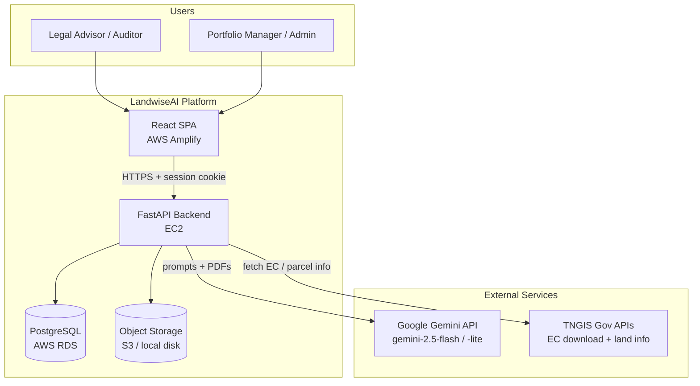
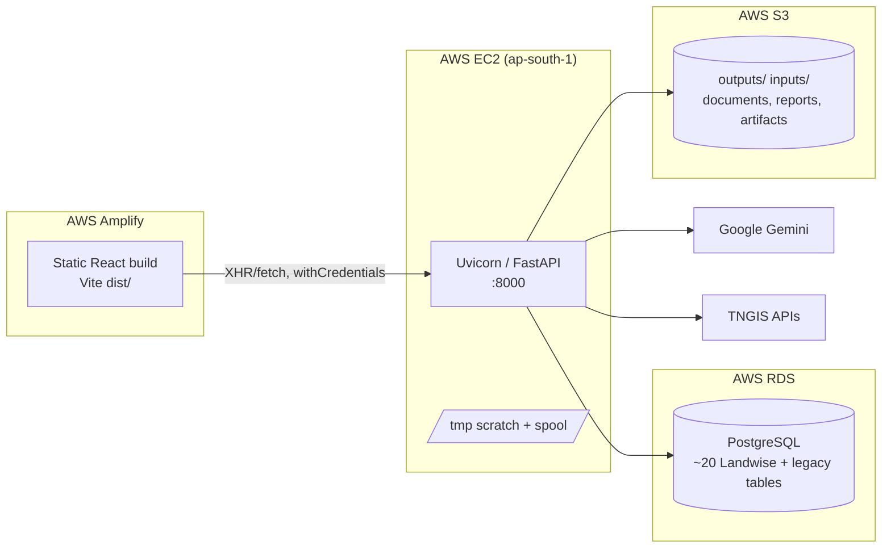
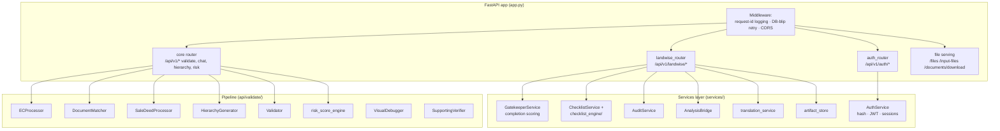
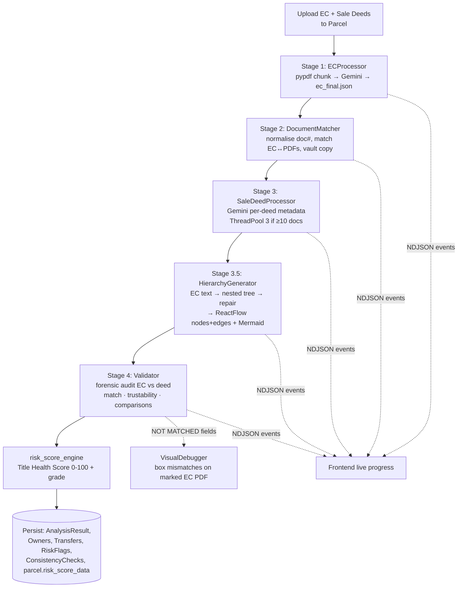
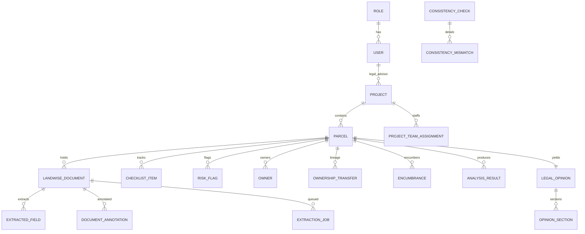
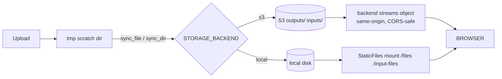

# LandwiseAI — System Design Architecture

> AI-powered **Tamil Nadu land-record title verification** platform. Legal advisors organise land into Projects → Parcels, upload Encumbrance Certificates (EC) and Sale Deeds, and the system extracts, matches, cross-validates, scores, and reports on the title chain using Google Gemini — with a bilingual (Tamil/English) reviewer cockpit on top.

This document describes the *as-built* architecture (June 2026). It supersedes the older `codebase_overview.md.resolved`, which predates the database, auth, project/parcel model, and risk-scoring layers.

---

## 1. System Context



**Primary use case:** Given an EC PDF and a set of Sale Deed PDFs for a survey number, produce a verified ownership lineage, per-document forensic validation, a 0–100 Title Health Score, and an AI-drafted legal opinion — all reviewable, annotatable, and overridable by a lawyer.

---

## 2. Deployment Topology



| Concern | Choice | Notes |
|---|---|---|
| Frontend hosting | AWS Amplify | builds `Client/` via `amplify.yml`, serves static `dist/` |
| Backend | FastAPI on Uvicorn (EC2, reached via `*.nip.io`) | single app process, port 8000 |
| Database | **RDS PostgreSQL only** | `common/database.py` *refuses* localhost unless `ALLOW_LOCAL_DB=true` |
| File storage | Pluggable: `STORAGE_BACKEND=s3 \| local` | S3 in prod; local disk for dev |
| Cross-origin | Explicit CORS allow-list + `allow_credentials` | wildcard is invalid with cookies; origins set via `CORS_ALLOW_ORIGINS` |
| Auth transport | HTTP-only `session_token` cookie | `SameSite=None; Secure` in prod (cross-site Amplify→nip.io) |

---

## 3. Frontend Architecture

React 18 + TypeScript + Vite, TailwindCSS, shadcn/Radix UI. Routing via React Router v6, server state via TanStack Query v5.

```
Client/src/
├── App.tsx                 # Router + providers (Auth, Query, Translation)
├── context/AuthContext     # session state, ProtectedRoute gate
├── lib/
│   ├── api.ts              # axios root (API_BASE_URL, withCredentials)
│   ├── landwise-api.ts     # typed client for /api/v1/landwise/*
│   ├── landwise-checks.ts  # checklist contract (6 AI-check ids + manual checks)
│   └── translation.tsx     # <Bi> bilingual component + TA/EN/Both toggle
├── pages/                  # Landing, Login, Signup, LegalDashboard, Map, Hierarchy, Index
└── features/               # feature-sliced UI
    ├── analysis/           # DocumentAnalysis, DocChat, OverallChat, RiskScoreCard,
    │                       #   ValueComparisonAudit, PdfAnnotator, TrustabilityScore
    ├── hierarchy/          # ReactFlowHierarchy (ownership tree canvas)
    ├── validation/         # UploadForm, StreamingMessages, FileDropZone
    ├── timeline/           # SurveyTimeline
    └── notes/              # NotesSummary (annotation cockpit)
```

**Key patterns**
- **Streaming reads:** analysis uses `fetch()` (not axios) to consume the backend's NDJSON progress stream (`step_start` / `step_complete` / `sub_log` / `result`), rendered live by `StreamingMessages` / `LiveAnalysisProgress`.
- **Bilingual layer:** every Tamil string can render via `<Bi>`; a global TA/EN/Both toggle drives a batched `/translate` call (see [bilingual memory]).
- **PDF review:** `PdfAnnotator` (react-pdf-highlighter) with a `process.env` Vite shim and an exact-pinned `pdfjs-dist` matching the highlighter version.
- **Auth gate:** `ProtectedRoute` + `AuthContext` redirect unauthenticated users to `/login`; the cookie rides along automatically (`withCredentials`).

---

## 4. Backend Architecture

FastAPI app (`app.py`) composed of three routers plus the static/stream file layer.



### 4.1 Routers

| Router | Prefix | Responsibility |
|---|---|---|
| `auth_router` | `/api/v1/auth` | signup, login, logout, `get_current_user` (cookie → JWT → User) |
| `landwise_router` | `/api/v1/landwise` | full CRUD: Projects, Parcels, Documents, Annotations, Checklist, Risks, Consistency, Opinions, hierarchy, analyze, translate |
| core `router` | `/api/v1` | validation pipeline, EC download, land info, chat (`-with-doc` / `-overall`), visual-debug, survey timeline, report, risk score |

### 4.2 Services layer (`services/`)
Thin domain services that keep routers slim and side-effects testable:
- **GatekeeperService** — parcel `completion_score` (batched, to avoid N+1 on the sidebar).
- **ChecklistService** + **checklist_engine/** — seeds a default checklist, syncs new items into old parcels, and `auto_populate_from_extraction` auto-suggests verdicts from completed AI analysis (UI verdict vocab: `pending/clear/issue/escalated/na` — see [checklist memory]). The engine has `providers`, `extractors` (incl. `DocTypeClassifier`), `external_sources`, and `results`.
- **AuditService** — append-only `AuditLog` for status changes and verdict edits.
- **AnalysisBridge** — adapts pipeline output into the Landwise relational model.
- **translation_service** — Gemini-backed Tamil→English batch translation.
- **artifact_store** — read/write JSON artifacts (e.g. `doc_classifications.json`) keyed per parcel/run.
- **AuthService** — password hashing, strength validation, JWT encode/decode.

### 4.3 Cross-cutting middleware
1. **Request-ID logging** — every request gets a UUID + per-endpoint `RequestLogger` writing to `.logs/<endpoint>/<uuid>/`; UUID echoed in `X-Request-ID`.
2. **DB-blip retry** — transparent one-shot retry of `OperationalError` on idempotent (GET/HEAD/OPTIONS) requests; unsafe methods fall through to a 503.
3. **CORS** — explicit credentialed allow-list (wildcard forbidden with cookies).
4. **Startup migrations** — `Base.metadata.create_all()` + idempotent `ADD COLUMN IF NOT EXISTS` statements (create_all does not alter existing tables).

---

## 5. Core Workflow — Parcel Analysis Pipeline

`POST /api/v1/landwise/parcels/{id}/analyze` (optionally `?stream=true`) runs a generator pipeline that streams NDJSON progress and persists results to Postgres + storage.



**Design properties**
- **Generator streaming** — the whole pipeline yields events; nothing is held fully in memory, and the UI shows real-time stage progress.
- **Idempotent caching** — `ec_final.json`, `<doc>_metadata.txt`, and risk-score results are checked before re-calling Gemini. The validation cache is keyed by `VALIDATION_PROMPT_VERSION` — bump it after editing prompts or stale verdicts are served (see [validation-cache memory]).
- **Parallelism** — sale-deed extraction and validation switch to `ThreadPoolExecutor(max_workers=3)` for ≥10 documents.
- **Survey-number hierarchy** — prefix rules build the lineage (`46 → 46/1 → 46/1A → 46/1A1`) with boundary handling so `46/1` is a parent of `46/1A` but not `46/11`.
- **Workflow checkpoints** — `common/workflow_checkpoint.py` persists resumable checkpoints retrievable via `/workflow-checkpoint/{request_id}`.

### Secondary AI workflows
| Endpoint | Purpose | Model |
|---|---|---|
| `/chat-with-doc` | Q&A scoped to one document; persists to `ChatMessage` | flash |
| `/chat-overall` | Property-wide, screen-aware chat with `@`-mention focus | flash |
| `/analyze-ec` | Historical EC value analysis | flash |
| `/verify-supporting-doc` | Aadhaar/PAN/Death-cert vs deed parties | flash |
| `/generate-report/{id}` | AI-drafted legal opinion (sections, verdict) | flash |
| `/get-risk-score/{id}` | Title Health Score (cached on parcel row) | flash-lite |
| `/translate` | Tamil→English bilingual display | flash-lite |

---

## 6. Data Architecture

PostgreSQL via SQLAlchemy. Two schemas coexist: **legacy** (`common/models.py` — `ValidationResult`, node notes) and the **Landwise relational model** (`common/landwise_models.py` — ~20 tables).



**Notable model decisions**
- **Soft deletes** — parcels (`is_active`/`deleted_at`) and documents (`deleted_at`); re-creating a deleted survey number *restores* it.
- **Storage indirection** — `LandwiseDocument.storage_key` + `storage_backend` point at S3/local; large `file_content` BLOBs are skipped on S3 to avoid multi-MB bulk inserts crashing RDS (only kept for local/legacy rows).
- **Dedup** — documents deduped by `checksum_sha256` per parcel.
- **Audit trail** — `AuditLog` is append-only; `Notification`, `ExternalFetchLog` capture side-channels.
- **Result caching on the row** — `parcel.risk_score_data` (JSONB) + `risk_score_computed_at` cache the Title Health Score.

### RBAC
Role-scoped visibility enforced in the router: `super_admin` / `portfolio_manager` see all projects; everyone else sees only owned or team-assigned projects (`_project_query_for_user` / `_ensure_project_visible`).

---

## 7. File & Object Storage



- **Why stream S3 through the backend** instead of presigned redirects: browsers send `Origin: null` on followed cross-origin redirects, and pdf.js can't follow them — so the backend proxies bytes in chunks (256 KB for docs) on a same-origin response that CORS handles cleanly.
- **Atomic uploads** — `_UploadCleanup` wraps DB + S3 + scratch so a mid-flight failure (exception, client disconnect, shutdown) leaves no orphan rows or objects; DB commits in one transaction with batched flushes.
- **Immutable caching** — per-UUID document downloads are served `Cache-Control: immutable, max-age=1y` (a doc UUID never changes content).

---

## 8. External Integrations

| Integration | Module | Detail |
|---|---|---|
| **Google Gemini** | `common/gemini_helper.py` | `google-genai` client; text + file-upload modes; `temperature=0.0, top_p=0.1` for determinism; 3× retry w/ exponential backoff on 503/overload |
| **TNGIS EC API** | `api/download_ec/ec_downloader.py` | XSRF-token session handling; decodes base64 EC PDF |
| **TNGIS Land Info** | `api/getlandinfo/handler.py` | parcel info by lat/lng |

Prompt templates live in `Server/prompts/` (ec, sale_deed, hierarchy, validation, supporting, risk_score, opinion, ec_analysis, aux_extraction).

---

## 9. Technology Stack

| Layer | Technology |
|---|---|
| Frontend | React 18, TypeScript, Vite, TailwindCSS, shadcn/Radix UI, TanStack Query v5, React Router v6 |
| Visualisation | ReactFlow v11 (hierarchy), OpenLayers (map), Mermaid (static tree), Chart.js |
| PDF | pdfjs-dist (version-pinned), react-pdf-highlighter |
| Backend | Python 3, FastAPI, Uvicorn, Pydantic |
| ORM / DB | SQLAlchemy, psycopg2, PostgreSQL (RDS) |
| Storage | boto3 / S3, local disk fallback |
| AI/LLM | Google Gemini (`gemini-2.5-flash`, `-flash-lite`) |
| PDF parsing | pypdf, PyMuPDF (fitz), pytesseract (OCR) |
| Auth | cookie session + JWT, password hashing |
| Hosting | AWS Amplify (FE) · EC2 (BE) · RDS (DB) · S3 (files) |

---

## 10. Key Cross-Cutting Concerns (summary)

| Concern | Approach |
|---|---|
| **Observability** | per-request UUID, per-endpoint log dirs, `X-Request-ID` echo |
| **Resilience** | DB pre-ping + recycle (280s), GET retry-once on DB blips, Gemini retry/backoff |
| **Consistency** | single-transaction uploads, atomic cleanup, soft deletes + restore |
| **Performance** | result caching (EC/metadata/risk), batched completion scores, aggregate annotation counts, ThreadPool for ≥10 docs, chunked PDF streaming, immutable doc caching |
| **Security** | HTTP-only Secure cookies, RBAC project scoping, password strength rules, CORS allow-list, path-traversal guards on file endpoints |
| **Schema evolution** | `create_all` + idempotent column migrations at startup |
| **i18n** | Tamil/English bilingual display via `<Bi>` + `/translate` |

---

*Generated from source inspection of `Server/app.py`, `api/landwise/router.py`, `api/auth/router.py`, `common/database.py`, the `services/` and `api/validate/` packages, and `Client/src/`. For the per-stage prompt logic and validation rules, see `codebase_overview.md.resolved` §"Validation Prompt Rules".*
